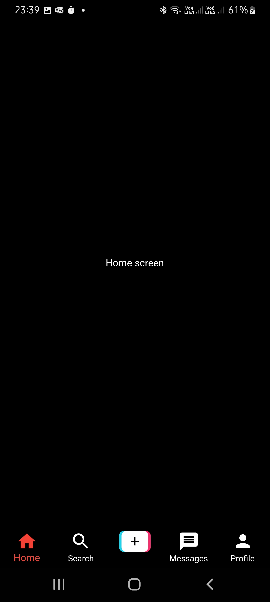

# Tiktok Clone

Hello there.
This is a Tiktok clone developed in flutter.
This app is being developed according to the classes of:

Flutter & Firebase Tutorial: Build 5 Social Media Apps - UDEMY;

### Versions

- **Flutter**: 3.0.5
- **Dart**: 2.17.6

### Setup

Clone it in your machine:
```bash
git clone https://github.com/RodrigoNP3/Tiktok_Clone.git
```

Dependecies:

```bash
dependencies:
  cupertino_icons: ^1.0.2
  get: ^4.6.5
  firebase_core: ^1.24.0
  firebase_auth: ^3.11.0
  cloud_firestore: ^3.5.0
  firebase_storage: ^10.3.10
  image_picker: ^0.8.5+3
  video_player: ^2.4.7
```

### Navigation


<table>
<thead>
<tr>
<th align="center">Login Screen</th>
<th align="center">Register Screen</th>
<th align="center">Feed</th>


</tr>
</thead>
<tbody>
<tr>
  
<td align="center">
  <a target="_blank" rel="" href="images/Login_screen.jpg">
        

  </a></td>
  
<td align="center">
  <a target="_blank" rel="" href="images/Register_screen.jpg">
        

  </a></td>
  
 <td align="center">
  <a target="_blank" rel="" href="images/Feed_screen.jpg">
        

  </a></td>
  
