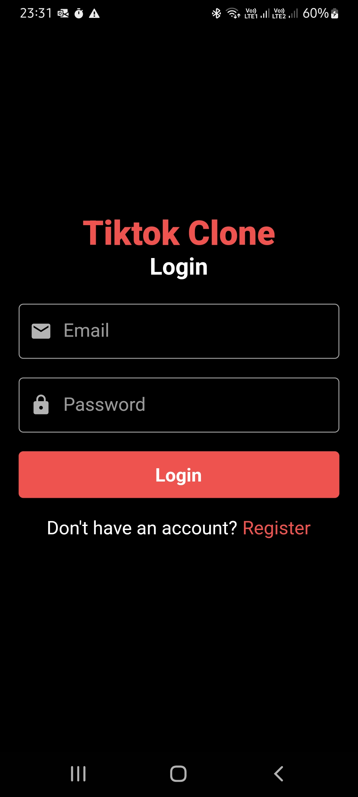
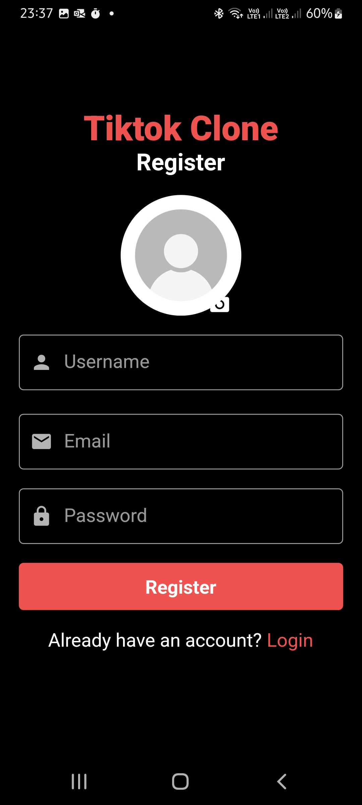
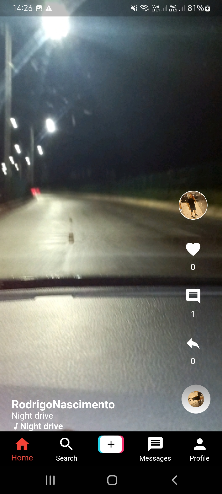
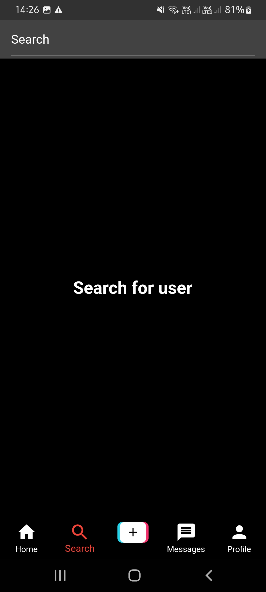
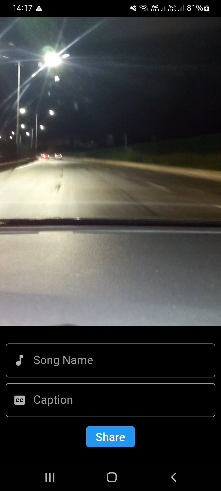
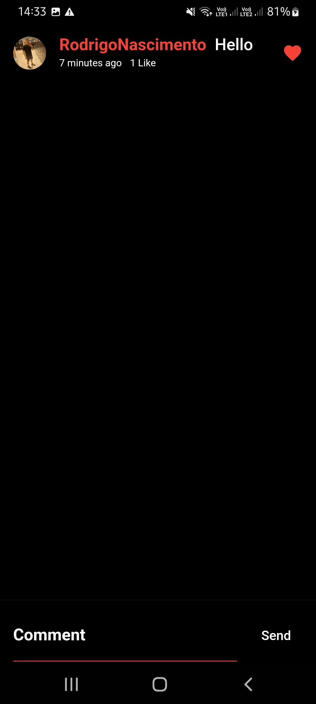
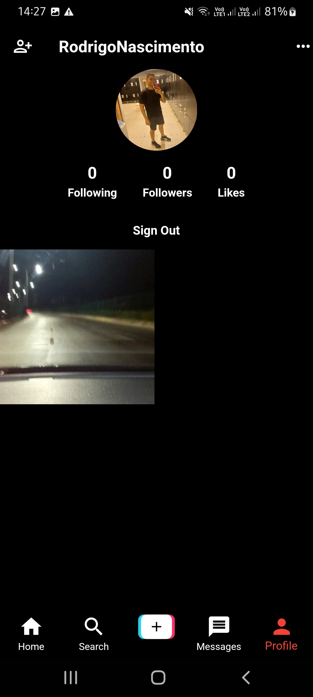

# Tiktok Clone

Hello there.
This is a Tiktok clone developed in flutter.
This app was developed according to the classes of:

Flutter & Firebase Tutorial: Build 5 Social Media Apps - UDEMY;

### Versions

- **Flutter**: 3.0.5
- **Dart**: 2.17.6

### Setup

Clone it in your machine:
```bash
git clone https://github.com/RodrigoNP3/Tiktok_Clone.git
```

Dependecies:

```bash
dependencies:
  cupertino_icons: ^1.0.2
  get: ^4.6.5
  firebase_core: ^1.24.0
  firebase_auth: ^3.11.0
  cloud_firestore: ^3.5.0
  firebase_storage: ^10.3.10
  image_picker: ^0.8.5+3
  video_player: ^2.4.7
  video_compress: ^3.1.1
  timeago: ^3.3.0
  cached_network_image: ^3.2.0
```

Firebase Setup:

1 - Create a new firebase project in the firebase console;
You can deactivate the Google Analytics.

2 - Setup authentication by email/password;

3 - Create a Firestore Database;

Change the rules from:

```bash
rules_version = '2';
service cloud.firestore {
  match /databases/{database}/documents {
    match /{document=**} {
      allow read, write: if
          request.time < timestamp.date(2022, 10, 31);
    }
  }
}
```

Change to:

```bash
rules_version = '2';
service cloud.firestore {
  match /databases/{database}/documents {
    match /{document=**} {
      allow read, write: if request.auth != null;
    }
  }
}
```

4 - Create a Storage Database;

Change the rules from:

```bash
rules_version = '2';
service firebase.storage {
  match /b/{bucket}/o {
    match /{allPaths=**} {
      allow read, write: if false;
    }
  }
}
```

Change to:

```bash
rules_version = '2';
service firebase.storage {
  match /b/{bucket}/o {
    match /{allPaths=**} {
      allow read, write: if request.auth != null;
    }
  }
}
```

5 - Create an iOS app;

Apple bundle id:
com.example.tiktokClone

Download the GoogleService-Info.plist and put it in the Runner folder.

ios>Runner>GoogleService-Info.plist

You can skip the next iOS app creation steps.

6 - Create an Android app;

Android package name:
com.example.tiktok_clone

Download the google-services.json and put it in the app folder.

android>app>google-services.json

You can skip the next Android app creation steps.

### Navigation


<table>
<thead>
<tr>
<th align="center">Login Screen</th>
<th align="center">Register Screen</th>
<th align="center">Feed</th>
<th align="center">Search Screen</th>


</tr>
</thead>
<tbody>
<tr>
  
<td align="center">
  <a target="_blank" rel="" href="images/Login_screen.jpg">
        

  </a></td>
  
<td align="center">
  <a target="_blank" rel="" href="images/Register_screen.jpg">
        

  </a></td>
  
 <td align="center">
  <a target="_blank" rel="" href="images/Feed_screen_01.jpg">
        

  </a></td>
  
 <td align="center">
  <a target="_blank" rel="" href="images/search_user_screen.jpg">
        

  </a></td>

  

<table>
<thead>
<tr>
<th align="center">Add Video Screen</th>
<th align="center">Add Video Screen</th>
<th align="center">Comments Screen</th>
<th align="center">Profile Screen</th>


</tr>
</thead>
<tbody>
<tr>
  
<td align="center">
  <a target="_blank" rel="" href="images/add_video_screen 02.jpg">
        

  </a></td>
  
<td align="center">
  <a target="_blank" rel="" href="images/Add_video_screen.jpg">
        

  </a></td>
  
 <td align="center">
  <a target="_blank" rel="" href="images/comments_screen.jpg">
        

  </a></td>
  
 <td align="center">
  <a target="_blank" rel="" href="images/Profile_screen.jpg">
        

  </a></td>
